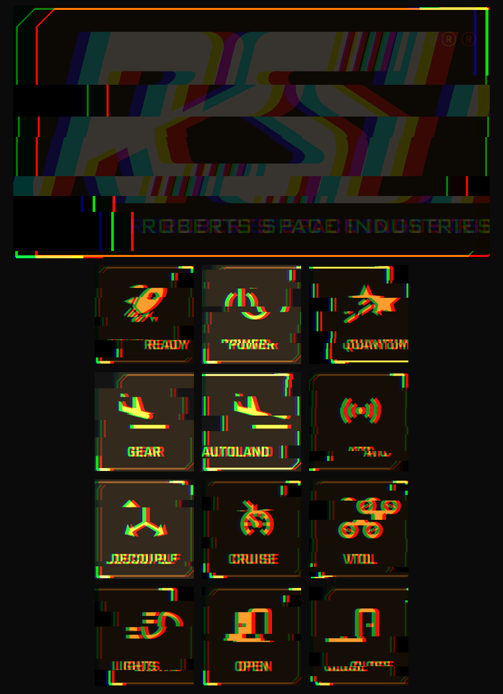

# Star Citizen add-on

A Galleon Deck profile for Star Citizen 4.x. It has keys for flight, combat, power,
ops, comms, on foot and emotes, plus seven themes styled on the game's own UI.
The deck switches to this profile while the game has focus and switches back when you
leave the game.

Download `star-citizen-<version>.tar.gz` from the
[releases](https://github.com/NLMP-DDHS/galleon-deck-addons/releases). Then, in the
Galleon Deck app, open **Add-ons** and click **Install from file…**. Or run:

```sh
galleon-addon install ~/Downloads/star-citizen-1.0.0.tar.gz
```

## What you get

- **8 pages** (turn the right dial to change page, press it to go back to **flight**):
  flight · combat · power · ops · comms · on foot · emotes · look.
- **Auto-switch:** the profile holds its own rule for the game window
  (`starcitizen.exe`). The RSI Launcher is left alone, so the deck only switches once
  you're in the game.
- **Themes in the game's style:** keys with cut corners and bright corner ticks, the
  Rajdhani and Orbitron fonts, and one palette each for the mobiGlas holo UI and six
  manufacturer MFD looks:

  | Theme | Look |
  |---|---|
  | `sc-mobiglas` (default) | ice cyan on deep navy, like the mobiGlas and visor HUD |
  | `sc-rsi` | RSI blue with white |
  | `sc-aegis` | cold white on navy with a blue edge |
  | `sc-drake` | industrial amber on black |
  | `sc-anvil` | military night-vision green |
  | `sc-origin` | ivory and gold |
  | `sc-misc` | teal with safety yellow |

  Choose one on the **look** page, or in the Galleon Deck app. The palettes were
  picked by eye from the game's look. They are not official colours.
- **Your own binds:** each key records the game action it triggers. The install reads
  your in-game keyboard binds and updates the keys to match. After you rebind something
  in the game, press **SYNC BINDS** on the look page, click **Run** next to *Sync binds* in
the app's Add-ons tab, or run:

  ```sh
  galleon-addon run star-citizen sync-binds            # --dry-run to preview
  ```

  The tool reads the game's defaults from `Data.p4k`, so they stay current after
  patches. It then applies your rebinds from `user/client/0/Profiles/default/actionmaps.xml`.
  It finds the game through the LUG helper's config or common Wine prefixes; pass
  `--game-dir` otherwise, and `--channel PTU` for the PTU. It never writes to the
  game folder.

## Reading the keys

- **Bright frame = hold.** Keep the key held, as you would on the keyboard: quantum
  (hold B switches the master mode), autoland, ping, look behind, docking camera, push
  to talk, and the loot, meds and throwable menus. The engineering + keys also set
  that system to max when held.
- **Dim = unbound.** The game has no keyboard bind for that action yet, so the key
  does nothing. The doors and emotes have none by default. Bind them in
  *Options > Keybindings*, then sync.
- Keys press real keyboard shortcuts, so they work with a HOTAS plugged in too. The
  deck covers the switches your stick doesn't have.
- The **look** page carries both marks as a legend, in whatever theme you're using:
  a `= HOLD` key with the bright frame and a dim `= UNBOUND` key. Neither does
  anything when pressed.

## The switch animation's logo




When the deck switches to this profile it plays a short glitch with the profile's
logo on the top screen. Out of the box that's the profile's name as a wordmark: this
package deliberately ships no Star Citizen artwork, because the RSI and Star Citizen
logos are Cloud Imperium's trademarks and aren't ours to redistribute.

To use the real thing, take it from CIG's own Fan Kit, downloadable from
[robertsspaceindustries.com](https://robertsspaceindustries.com). Its `03_LOGOS` folder
holds `RSI_WHITE.png`, `STARCITIZEN_WHITE.png` and the rest:

```sh
mkdir -p ~/.config/galleon-deck/logos
cp '.../Fankit_.../03_LOGOS/RSI_WHITE.png' ~/.config/galleon-deck/logos/rsi-white.png
```

Then pick it in the Galleon Deck app under **Look → Profile logo**, or add to
`~/.config/galleon-deck/profiles/star-citizen.toml`:

```toml
logo = "logos/rsi-white.png"
```

The white versions read best on the dark themes, and upgrading the add-on keeps your
choice. The kit is published for fan use under CIG's fan content policy; check its terms,
and keep the artwork on your own machine rather than redistributing it.

## Key map (game defaults)

The defaults in Star Citizen 4.10. After a sync, your profile follows your own binds.

**flight**

| Key | Default bind | In game |
|---|---|---|
| READY | `RIGHTALT+R` | Flight / Systems Ready |
| POWER | `U` | Toggle Power - All |
| QUANTUM (hold) | `B` | Cycle Master Mode (Long Press) |
| GEAR | `N` | Landing System (Toggle) |
| AUTOLAND (hold) | `N` | Autoland |
| ATC | `LEFTALT+N` | Request Landing |
| DECOUPLE | `C` | Enable / Disable decoupled mode |
| CRUISE | `LEFTALT+C` | Throttle - Cruise Mode - Toggle |
| VTOL | `K` | Toggle VTOL |
| LIGHTS | `L` | Headlights (Toggle) |
| OPEN | unbound | Open All Doors |
| CLOSE | unbound | Close All Doors |

**combat**

| Key | Default bind | In game |
|---|---|---|
| DECOY | `H` | Decoy - Launch Burst (tap), Set and Launch Burst (hold) |
| NOISE | `J` | Noise - Deploy (Tap) |
| GIMBAL | `G` | Gimbal State - Toggle Locked / Unlocked |
| HOSTILE | `5` | Cycle Lock - Hostiles - Forward |
| ATTACKER | `4` | Cycle Lock - Attackers - Forward |
| FRIENDLY | `6` | Cycle Lock - Friendlies - Forward |
| IN VIEW | `T` | Cycle Lock - In View - Forward |
| SUBTARGET | `R` | Cycle Lock - Sub-Target - Forward |
| UNLOCK | `LEFTALT+T` | Unlock Current Target |
| AIM MODE | `RIGHTALT+G` | Aim Mode - Cycle |
| LOOK BACK (hold) | `COMMA` | Look behind |
| HAIL | `9` | Hail Target |

**power**

| Key | Default bind | In game |
|---|---|---|
| WEP + | `F5` | Weapons - Increase (Tap) |
| THR + | `F6` | Engines - Increase (Tap) |
| SHD + | `F7` | Shields - Increase (Tap) |
| WEP - | `LEFTALT+F5` | Weapons - Decrease (Tap) |
| THR - | `LEFTALT+F6` | Engines - Decrease (Tap) |
| SHD - | `LEFTALT+F7` | Shields - Decrease (Tap) |
| WEAPONS | `P` | Toggle Power - Weapons |
| THRUSTERS | `I` | Toggle Power - Thrusters |
| SHIELDS | `O` | Toggle Power - Shields |
| RESET | `F8` | Reset Assignments |
| POWER | `U` | Toggle Power - All |
| READY | `RIGHTALT+R` | Flight / Systems Ready |

**ops**

| Key | Default bind | In game |
|---|---|---|
| SCAN | `V` | Toggle Scanning Operator Mode |
| PING (hold) | `TAB` | Activate Ping (Hold & Release) |
| MINE / SALV | `M` | Toggle Mining Operator Mode |
| MODULE 1 | `LEFTALT+1` | Activate Mining Module (Slot 1) |
| MODULE 2 | `LEFTALT+2` | Activate Mining Module (Slot 2) |
| MODULE 3 | `LEFTALT+3` | Activate Mining Module (Slot 3) |
| JETTISON | `LEFTALT+J` | Jettison Cargo |
| CARGO REQ | `RIGHTALT+N` | Request Cargo Loading |
| DOCK CAM (hold) | `0` | Toggle Docking Camera |
| PORTS | `RIGHTALT+K` | Port Lock Toggle All |
| NIGHT VIS | `RIGHTALT+L` | Light Amplification Toggle |
| MFD PAGE | `LEFTALT+E` | MFD - Cycle Page - Forwards (Short Press) |

**comms**

| Key | Default bind | In game |
|---|---|---|
| MOBIGLAS | `F1` | mobiGlas (Toggle) |
| MAP | `F2` | Map |
| COMMS | `F11` | CommLink App (Toggle) |
| CHAT | `F12` | Chat Window (Toggle) |
| ACCEPT | `LEFTBRACE` | Notifications - Accept Prompt |
| DECLINE | `RIGHTBRACE` | Notifications - Decline Prompt |
| TALK (hold) | `KPPLUS` | VOIP Push To Talk |
| CHANNEL | `KPDOT` | Cycle through audio channels |
| CAMERA | `F4` | Cycle camera view |
| EMOTES | page: emotes | — |
| SHOT | screenshot | — |
| HEAD TRACK | `KPSLASH` | Enable Head Tracking (Toggle) |

**on foot**

| Key | Default bind | In game |
|---|---|---|
| HELMET | `RIGHTALT+H` | Toggle Equip Helmet |
| LIGHT | `T` | Flashlight (Toggle) |
| VISOR WIPE | `LEFTALT+X` | Wipe Helmet Visor |
| INVENTORY | `I` | Toggle Inventory (short press) |
| LOOT (hold) | `I` | Toogle Loot Screen (hold) |
| MEDS (hold) | `4` | Consumable Select Radial Menu  |
| PRIMARY | `1` | Select Primary Weapon |
| SECONDARY | `2` | Select Secondary Weapon |
| SIDEARM | `3` | Select Sidearm |
| THROWABLE (hold) | `G` | Throwable Select Radial Menu |
| STANCE | `LEFTALT+R` | Weapon Stance (Toggle) |
| FIRE MODE | `B` | Change Fire Mode |

**emotes**

| Key | Default bind | In game |
|---|---|---|
| WAVE | unbound | Wave |
| SALUTE | unbound | Salute |
| GREET | unbound | Greet |
| POINT | unbound | Point |
| SIT | unbound | Sit |
| AT EASE | unbound | At Ease |
| FLEX | unbound | Flex |
| GLOAT | unbound | Gloat |
| COME | unbound | Come |
| CRY | unbound | Cry |
| ANGRY | unbound | Angry |
| BACK | page: back | — |

**look:** one key per theme, **SYNC BINDS**, the `= HOLD` and `= UNBOUND` legend keys, and back.

The generated **settings** page (brightness, profiles) comes last, as in every profile.

## Removing it

```sh
galleon-addon remove star-citizen
```

This removes the profile and themes, and any `config.toml` rule that points at them.
Before deleting the profile, it backs it up (with your synced binds) to
`~/.local/state/galleon-deck/addons/backups/`.

Not affiliated with Cloud Imperium Games. Star Citizen® is a trademark of Cloud
Imperium Rights LLC.
